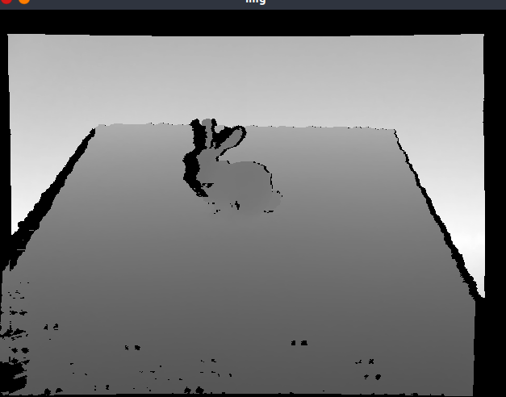

## Apply some kinds of diffusion algorithm for inpainting 2D or 3D grid.

## Note
Only for 2d depth image (16bit) now. But it is easy to be extended to gray scale image or RGB image.

## Building Instruction

### Dependencies
+ OpenCV 3.+
+ CMake 3.14+
+ Eigen

* Note: Eigen is not necessary but you need to delete some dependent codes. All related codes are declared under Eigen namespace

## Usage

Drawing mask: ```./diffu_inpainting draw [input img path] [output mask path]```

Heat Diffusion: ```./diffu_inpainting heat [number of iteration (int)] [time step (float)] [input img path] [mask path] [output img path]```

Anisotropic Diffusion: ```./diffu_inpainting anisotropic [number of iteration (int)] [time step (float)] [input img path] [mask path] [output img path]```

## Result Demo
+ Original depth image



+ Heat diffusion result


+ Anisotropic diffusion result

